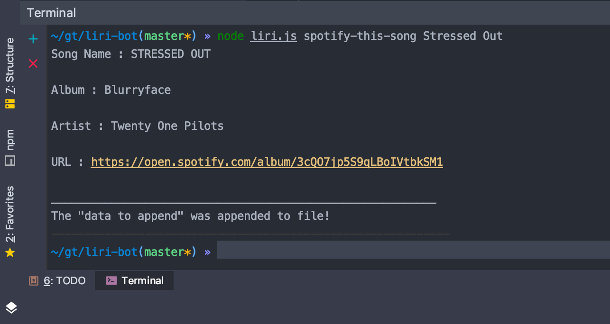
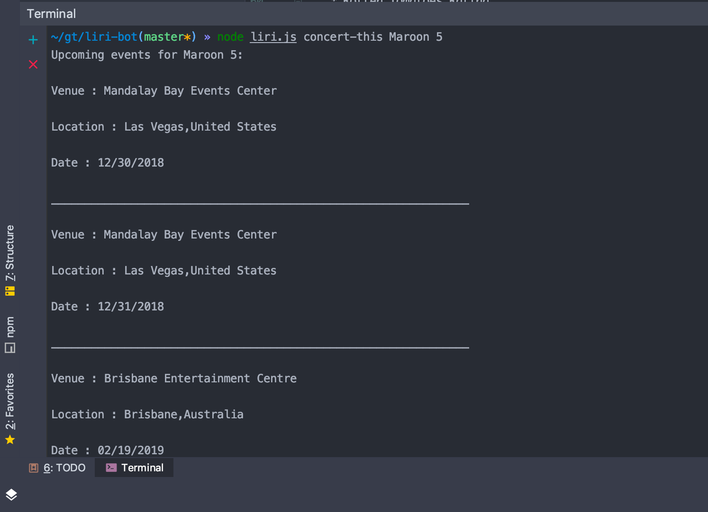
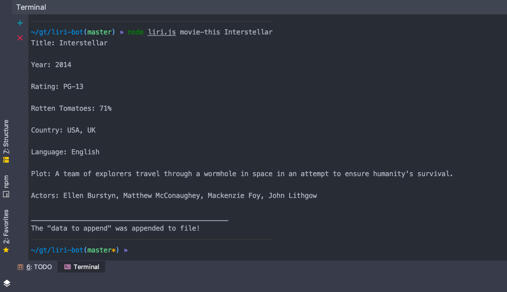
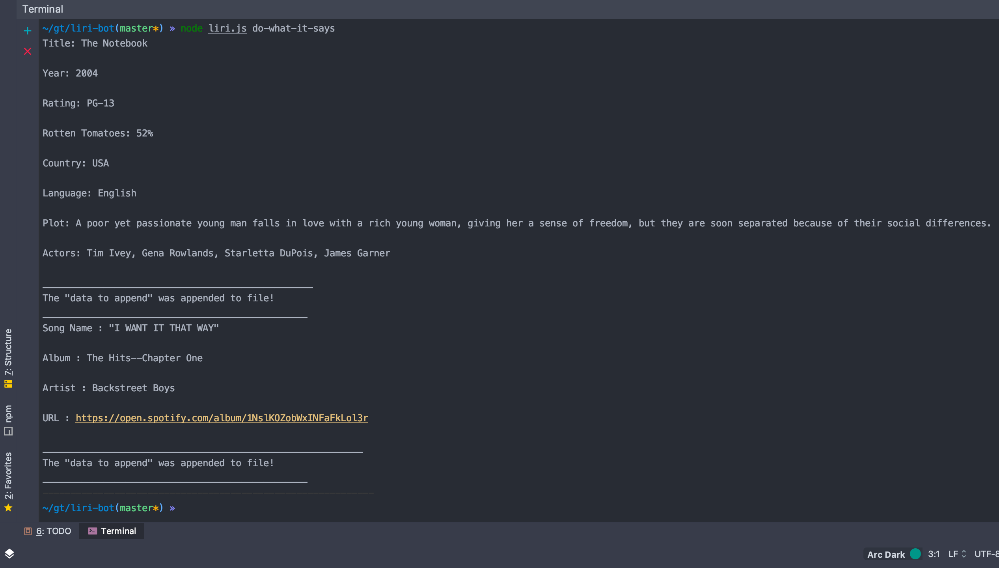

# LIRI-Bot
LIRI is a _Language_ Interpretation and Recognition Interface. LIRI will be a command line node app that takes in parameters and gives you back data.
## LIRI uses the following commands:

```
spotify-this-song
```
```
concert-this
```
```
movie-this
```
```
do-what-it-says
```

## Technologies used:

* Node.js
* Javascript
* Moment.js

## npm packages: 
* [Node-Spotify-API](https://www.npmjs.com/package/node-spotify-api) - A simple to use API library for the Spotify REST API.
* [request](https://www.npmjs.com/package/request) - Request is designed to be the simplest way possible to make http calls. It supports HTTPS and follows redirects by default.
* [dotenv](https://www.npmjs.com/package/dotenv) - Dotenv is a zero-dependency module that loads environment variables from a .env file into process.env.

## How to Run LIRI-Bot

* Command One: node liri.js spotify-this-song ```<song name here>```.
	
	This will show the following information about the song in your terminal/bash window: 
	* The song's name 
	* The album that the song is from
	* Artist(s) 
	* A preview link of the song from Spotify 

	If no song is provided then the program will default to
	"The Sign" by Ace of Base.
	
	
	
* Command Two : node liri.js concert-this ```<artist/band name here>```.

    This will output the following to the terminal:
     * Name of the venue
     * Venue location
     * Date of the Event
     
    

* Command Three: node liri.js movie-this ```<movie name here>```.
	
	This will output the following information to your terminal/bash window:
	* Title of the movie.
	* Year the movie came out.
	* IMDB Rating of the movie.
	* Country where the movie was produced.
	* Language of the movie.
	* Plot of the movie.
	* Actors in the movie.
	* Rotten Tomatoes Rating.
	
	If the user doesn't type a movie in, the program will output data for the movie 'Mr. Nobody'

    
    
* Command Four: node liri.js do-what-it-says

	This will output the command placed in random.txt file
	
	

## Author
* **Kelvin K. Mundi** 
